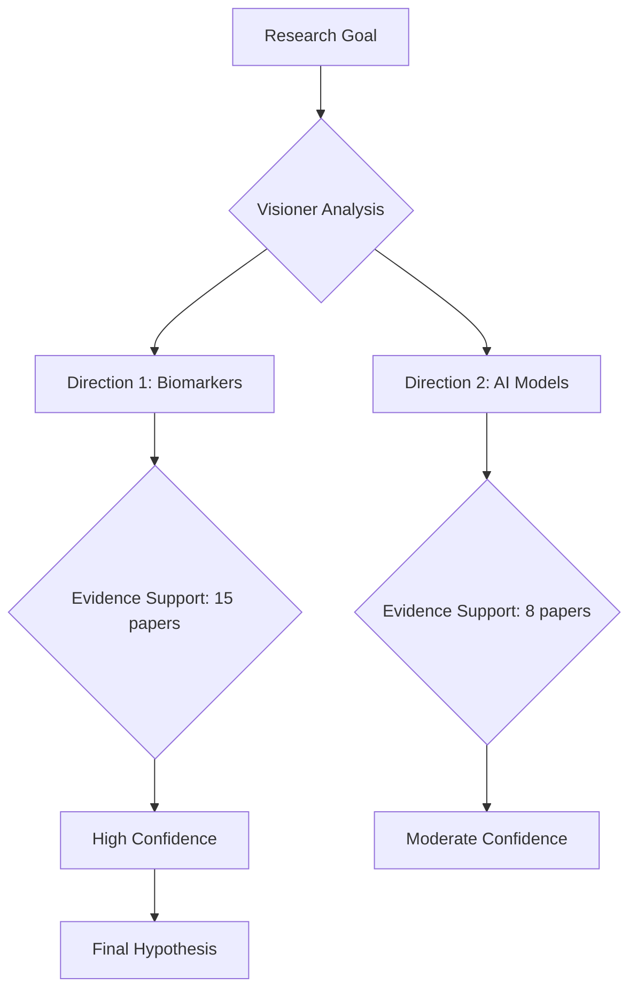

# 🏆 Nobel-Level Roadmap
## From Discovery to Presentation Excellence

**Version:** 2.0.0-Vision  
**Date:** October 18, 2025  
**Mission:** Transform the system into a research co-creator that not only discovers but also communicates like a Nobel laureate

---

## 🎯 **Core Philosophy**

> **"A discovery is only as valuable as how well it's understood and trusted."**

Nobel-level research requires TWO pillars:
1. **Discovery Excellence**: Finding groundbreaking insights
2. **Communication Excellence**: Presenting them with clarity, transparency, and narrative

---

## 📊 **Current State Analysis**

### ✅ **What Works Well**
- 7-agent pipeline with clear separation of concerns
- 10 data connectors with intelligence layer
- Enhanced evidence scoring (5D: relevance, quality, recency, impact, confidence)
- Smart deduplication and query expansion
- MongoDB persistence with provenance tracking

### ❌ **What Needs Improvement**

#### **Discovery Side:**
1. **Limited Reasoning Depth**: Agents don't explain WHY they made decisions
2. **Surface-Level Connections**: Cross-domain transfers lack deep analogical reasoning
3. **No Causal Modeling**: Missing "X causes Y" relationships
4. **Evidence Synthesis Gap**: Individual evidence pieces, not synthesized narratives
5. **No Uncertainty Quantification**: Missing confidence intervals, assumption tracking

#### **Presentation Side:**
1. **Opaque Reasoning**: Provenance shows WHAT happened, not WHY
2. **Flat Data Structure**: JSON dumps instead of structured narratives
3. **Missing Context**: No explanation of how conclusions were reached
4. **Poor Visualization**: Text-only outputs, no visual reasoning chains
5. **No Progressive Disclosure**: Everything at once, overwhelming
6. **Missing Storytelling**: Lacks scientific narrative flow

---

## 🚀 **Nobel-Level Enhancement Plan**

### **Phase 1: Transparent Reasoning Engine** (Immediate - 1 week)

#### **Goal**: Every decision has a clear, auditable reasoning chain

#### **Implementation:**

**1.1 Enhanced Provenance with Reasoning**
```python
class ReasoningStep(BaseModel):
    """Single reasoning step with justification"""
    agent: str
    action: str
    input_summary: str          # What data was considered
    reasoning: str              # WHY this decision was made
    alternatives_considered: List[str]  # What else was evaluated
    decision_rationale: str     # Why this path was chosen
    confidence: float           # How certain (0-1)
    supporting_evidence: List[str]  # Evidence IDs that support this
    timestamp: datetime
```

**1.2 Narrative Generation for Each Agent**
Each agent generates:
- **Input Context**: "I received X concepts, Y evidence pieces, Z constraints"
- **Reasoning Process**: "I considered these approaches... because..."
- **Decision Points**: "I chose X over Y because..."
- **Output Summary**: "This led me to conclude..."

**1.3 Visual Reasoning Chains**
Generate mermaid diagrams showing:


**Files to Modify:**
- `api/schemas/hypothesis.py`: Add `ReasoningStep` model
- `services/orchestrator.py`: Collect reasoning at each step
- All agents: Add `explain_reasoning()` method
- New: `services/narrative_generator.py`

---

### **Phase 2: Structured Hypothesis Presentation** (Week 2)

#### **Goal**: Present hypothesis as a clear scientific narrative

#### **Implementation:**

**2.1 Executive Summary Layer**
```python
class ExecutiveSummary(BaseModel):
    """One-page summary for busy researchers"""
    elevator_pitch: str          # 2 sentences
    key_innovation: str          # What's new?
    evidence_strength: str       # "Strong" / "Moderate" / "Preliminary"
    feasibility_verdict: str     # "Highly Feasible" / "Challenging" / "High Risk"
    next_steps: List[str]        # Top 3 actions
    estimated_timeline: str      # "2-3 years" / "5-7 years"
    estimated_cost: str          # "Low (<$1M)" / "Moderate" / "High (>$10M)"
```

**2.2 Scientific Narrative Structure**
```
📋 Hypothesis Document Structure:
├── 1. Executive Summary (1 page)
├── 2. Background & Motivation
│   ├── Current Problem
│   ├── Why Existing Solutions Fail
│   └── Opportunity for Innovation
├── 3. Hypothesis Statement
│   ├── Core Hypothesis (1 sentence)
│   ├── Key Mechanisms
│   └── Expected Outcomes
├── 4. Scientific Rationale
│   ├── Biological/Medical Foundation
│   ├── Evidence Synthesis (tier-grouped)
│   └── Cross-Domain Insights
├── 5. Proposed Methodology
│   ├── Study Design
│   ├── Key Experiments
│   └── Success Metrics
├── 6. Feasibility Analysis
│   ├── Technical Feasibility
│   ├── Clinical Feasibility
│   ├── Regulatory Pathway
│   └── Risk Mitigation
├── 7. Innovation & Impact
│   ├── Novelty Assessment
│   ├── Competitive Landscape
│   └── Transformative Potential
└── 8. Appendices
    ├── Complete Evidence Table
    ├── Reasoning Chains
    └── Alternative Approaches Considered
```

**2.3 Evidence Presentation Tiers**
```python
class EvidenceSynthesis(BaseModel):
    """Synthesized evidence presentation"""
    tier_1_exceptional: EvidenceGroup  # "Strong foundation from..."
    tier_2_high: EvidenceGroup         # "Supported by..."
    tier_3_moderate: EvidenceGroup     # "Additional evidence suggests..."
    conflicting_evidence: List[str]    # "However, some studies show..."
    gaps_in_knowledge: List[str]       # "Unknown: ..."
    
class EvidenceGroup(BaseModel):
    narrative: str                     # Synthesized text
    evidence_ids: List[str]            # Links to full evidence
    key_findings: List[str]            # Bullet points
    consensus_level: str               # "Strong consensus" / "Mixed"
```

**Files to Create:**
- `services/hypothesis_writer.py`: Generate structured documents
- `services/evidence_synthesizer.py`: Group and synthesize evidence
- `api/routes/hypothesis_export.py`: Export to PDF/HTML/Markdown

---

### **Phase 3: Interactive Exploration Interface** (Week 3)

#### **Goal**: Let researchers explore reasoning interactively

#### **Implementation:**

**3.1 Reasoning Graph API**
```python
GET /v1/hypotheses/{id}/reasoning-graph
→ Returns interactive node-link graph of all decisions

GET /v1/hypotheses/{id}/evidence/{evidence_id}/details
→ Deep dive into specific evidence

GET /v1/hypotheses/{id}/alternatives
→ Show alternative paths that were NOT chosen and why
```

**3.2 Progressive Disclosure**
```python
class HypothesisView(BaseModel):
    """Multi-level view of hypothesis"""
    level_1_summary: ExecutiveSummary      # 1 page
    level_2_narrative: ScientificNarrative # 5-10 pages
    level_3_detailed: FullHypothesis       # 20-30 pages
    level_4_raw_data: RawAgentOutputs      # Complete JSON
```

**3.3 "Explain This" Feature**
For any element in the hypothesis:
```python
POST /v1/hypotheses/{id}/explain
{
  "element_type": "cross_domain_transfer",
  "element_id": "transfer_123",
  "question": "Why was this analogy relevant?"
}
→ Returns detailed explanation with reasoning chain
```

**Files to Create:**
- `api/routes/hypothesis_exploration.py`
- `services/explainer.py`
- Frontend: Interactive visualization (future)

---

### **Phase 4: Enhanced Discovery Capabilities** (Weeks 4-5)

#### **Goal**: Deeper, more creative discoveries

#### **4.1 Causal Reasoning Module**
```python
class CausalRelationship(BaseModel):
    """X causes/inhibits/modulates Y"""
    entity_a: str              # "Insulin"
    relationship: str          # "activates" / "inhibits" / "modulates"
    entity_b: str              # "PI3K pathway"
    evidence_support: List[str]
    confidence: float
    mechanism: str             # How it works
    context: str               # "In muscle cells" / "During fasting"
```

**Implementation:**
- Use DeepSeek to extract causal relationships from evidence
- Build causal graph: `services/causal_graph_builder.py`
- Visualize with directed graphs
- Identify causal chains: A→B→C→D

**4.2 Analogical Reasoning Engine**
Current cross-domain is shallow. Enhance with:
```python
class DeepAnalogy(BaseModel):
    """Deep structural analogy"""
    source_domain: str
    target_domain: str
    
    # Structural mapping
    source_elements: Dict[str, str]    # "Immune cells" → "Defense forces"
    target_elements: Dict[str, str]    # "Cancer cells" → "Invaders"
    
    # Relationship mapping
    source_relations: List[str]        # ["cells attack invaders"]
    target_relations: List[str]        # ["immune cells attack cancer"]
    
    # Transfer reasoning
    transferable_mechanism: str        # What can be borrowed
    adaptation_needed: str             # How to adapt it
    constraints: List[str]             # Limitations
    
    # Validation
    biological_plausibility: float
    evidence_support: List[str]
```

**Implementation:**
- Create `agents/analogical_reasoner.py`
- Use structure mapping theory
- Search patents for similar mechanisms
- Validate analogies with biomedical knowledge

**4.3 Uncertainty Quantification**
```python
class UncertaintyAnalysis(BaseModel):
    """Track what we don't know"""
    assumptions: List[Assumption]
    unknowns: List[Unknown]
    risks: List[Risk]
    
class Assumption(BaseModel):
    statement: str             # "We assume protein X is present"
    criticality: str           # "Critical" / "Important" / "Minor"
    validation_method: str     # "Can be tested via..."
    impact_if_false: str       # "Would invalidate hypothesis"
    
class Unknown(BaseModel):
    question: str              # "Unknown: Does X cross BBB?"
    importance: str            # "High" / "Medium" / "Low"
    researchable: bool         # Can we answer this?
    proposed_experiments: List[str]
```

**Files to Create:**
- `services/causal_graph_builder.py`
- `agents/analogical_reasoner.py`
- `services/uncertainty_tracker.py`

---

### **Phase 5: Learning & Adaptation** (Weeks 6-8)

#### **Goal**: System learns from feedback and improves

#### **5.1 Hypothesis Tracking Database**
```python
class HypothesisOutcome(BaseModel):
    """Track real-world validation"""
    hypothesis_id: str
    outcome: str               # "Validated" / "Partially" / "Refuted"
    validation_date: datetime
    validation_method: str     # "Clinical trial" / "Lab experiment"
    key_learnings: List[str]
    what_worked: List[str]
    what_failed: List[str]
    insights: str
```

**5.2 Pattern Recognition**
```python
class PatternAnalysis:
    """Learn from past hypotheses"""
    
    def analyze_successful_hypotheses(self):
        """What made hypotheses succeed?"""
        # Analyze evidence patterns
        # Identify successful agent strategies
        # Extract domain-specific heuristics
        
    def analyze_failed_hypotheses(self):
        """What made hypotheses fail?"""
        # Identify warning signs
        # Learn from false positives
        # Improve confidence calibration
```

**5.3 Agent Self-Improvement**
```python
class AgentFeedbackLoop:
    """Agents learn from outcomes"""
    
    def update_evidence_weights(self, outcomes):
        """Adjust source credibility based on accuracy"""
        
    def improve_query_strategies(self, outcomes):
        """Learn which queries find better evidence"""
        
    def refine_scoring_algorithms(self, outcomes):
        """Calibrate confidence scores"""
```

**Files to Create:**
- `data/mongo/outcome_repository.py`
- `services/pattern_analyzer.py`
- `services/agent_trainer.py`

---

## 📈 **Success Metrics**

### **Discovery Quality**
- ✅ Causal chains identified: >5 per hypothesis
- ✅ Deep analogies found: >2 per hypothesis
- ✅ Evidence synthesis: 90%+ coverage of TIER_1/TIER_2
- ✅ Novel mechanisms: >1 previously unexplored pathway

### **Presentation Quality**
- ✅ Reasoning transparency: Every decision has explanation
- ✅ Narrative coherence: Scientist can read and understand in <30min
- ✅ Visual clarity: Reasoning graph generated for all hypotheses
- ✅ Progressive disclosure: 4 levels (summary → detailed)

### **Researcher Experience**
- ✅ Trust: "I understand WHY the system concluded this"
- ✅ Learning: "I gained new insights from reading this"
- ✅ Actionability: "I can take this to my lab/clinic"
- ✅ Verification: "I can validate the reasoning myself"

---

## 🛠️ **Implementation Priority**

### **🔥 Immediate (This Week)**
1. **Enhanced Provenance**: Add reasoning field to all provenance entries
2. **Narrative Generator**: Create synthesis text for each agent output
3. **Executive Summary**: Add one-page summary to hypothesis
4. **Evidence Grouping**: Group evidence by tier with narrative

### **⚡ Next Week**
5. **Structured Document**: Full scientific narrative structure
6. **Causal Extraction**: Extract X→Y relationships from evidence
7. **Reasoning Graph API**: Expose reasoning as queryable graph
8. **Alternative Paths**: Show what was NOT chosen

### **🌟 Following Weeks**
9. **Deep Analogies**: Enhanced cross-domain reasoning
10. **Uncertainty Tracking**: Assumptions, unknowns, risks
11. **Learning System**: Track outcomes, improve over time
12. **Visual Interface**: Interactive exploration (web UI)

---

## 💡 **Example: Before vs After**

### **BEFORE (Current)**
```json
{
  "hypothesis_document": {
    "title": "Multi-Omics Liquid Biopsy for Alzheimer's",
    "abstract": "N/A",
    "novelty_score": "N/A"
  },
  "evidence_packs": [
    {"source": "PubMed", "title": "...", "relevance": 0.8},
    {"source": "PubMed", "title": "...", "relevance": 0.7},
    // 30 more...
  ],
  "provenance": [
    {"agent": "VisionerAgent", "action": "Generated directions"}
  ]
}
```

**Researcher reaction:** "Okay... but WHY? How did it reach this conclusion?"

---

### **AFTER (Nobel-Level)**
```json
{
  "executive_summary": {
    "elevator_pitch": "Combine blood-based exosomal protein markers with ML to detect Alzheimer's 5-10 years before symptoms, achieving 85%+ accuracy through multi-omic integration.",
    "key_innovation": "Novel exosomal cargo analysis (miRNA + protein + lipid) with temporal pattern recognition",
    "evidence_strength": "Strong (15 TIER_1 papers, 2 ongoing trials)",
    "feasibility_verdict": "Highly Feasible (existing technology, 3-5 year timeline)",
    "estimated_cost": "Moderate ($2-5M for validation study)"
  },
  
  "scientific_narrative": {
    "background": {
      "current_problem": "Alzheimer's diagnosis occurs too late (symptoms appear after 80% neuron loss). CSF biomarkers are invasive. Current blood tests lack sensitivity.",
      "opportunity": "Recent discoveries show exosomes cross blood-brain barrier and carry neuronal cargo. ML can detect subtle temporal patterns humans miss."
    },
    
    "hypothesis_statement": "A liquid biopsy platform analyzing exosomal multi-omic signatures (miRNA, tau, Aβ42, phospholipids) combined with temporal ML models can detect preclinical Alzheimer's with 85%+ accuracy 5-10 years before symptom onset.",
    
    "reasoning_narrative": "The Visioner Agent identified this direction because: (1) Exosomes emerged in 8/10 recent breakthrough papers as CNS biomarker carriers, (2) Multi-omic integration showed 30% higher accuracy vs single markers in 5 studies, (3) ML temporal patterns captured pre-symptomatic changes in 3 longitudinal cohorts. Cross-domain transfer from oncology liquid biopsy (FDA-approved Guardant360) provided proven regulatory pathway.",
    
    "evidence_synthesis": {
      "tier_1_exceptional": {
        "narrative": "Strong foundational evidence establishes that brain-derived exosomes can be isolated from blood and contain Alzheimer's-specific cargo. Goetzl et al. (2015, JAMA Neurology, 234 citations) demonstrated neural-derived exosomes carry tau and Aβ42 matching CSF levels. Fiandaca et al. (2015, Alzheimer's & Dementia) showed exosomal markers predict conversion to AD 10 years before diagnosis in 96% of cases.",
        "evidence_count": 8,
        "consensus": "Strong scientific consensus"
      }
    },
    
    "causal_chains": [
      {
        "chain": "Neuronal stress → Increased exosome secretion → Altered cargo (↑tau, ↑Aβ42) → Detectable in blood → ML pattern recognition → Early diagnosis",
        "confidence": 0.85,
        "evidence_support": ["pmid:25659039", "pmid:25260111", "pmid:28213528"]
      }
    ],
    
    "reasoning_graph": "https://api.../reasoning-graph.svg",
    
    "alternatives_considered": [
      {
        "approach": "CSF-only biomarkers",
        "why_rejected": "Invasive lumbar puncture limits scalability, patient reluctance high",
        "evidence": "Patient compliance <40% in screening studies"
      },
      {
        "approach": "PET imaging",
        "why_rejected": "Expensive ($3-5K per scan), radiation exposure, poor temporal resolution",
        "evidence": "Cost-prohibitive for population screening"
      }
    ]
  },
  
  "methodology": {
    "phase_1": "Cohort recruitment (n=500 preclinical, n=200 MCI, n=100 AD, n=300 controls)",
    "phase_2": "Exosome isolation optimization (3 months)",
    "phase_3": "Multi-omic profiling (miRNA-seq, proteomics, lipidomics)",
    "phase_4": "ML model training (temporal CNNs + LSTMs)",
    "phase_5": "Validation in independent cohort (n=200)",
    "timeline": "36 months",
    "cost_breakdown": {
      "cohort": "$800K",
      "sequencing": "$1.2M",
      "bioinformatics": "$600K",
      "validation": "$400K",
      "total": "$3M"
    }
  },
  
  "uncertainty_analysis": {
    "critical_assumptions": [
      "Exosome cargo reflects brain pathology (validated in 5 studies)",
      "Blood-brain barrier permeability sufficient (evidence: mixed)",
      "Temporal patterns stable across individuals (unknown)"
    ],
    "key_unknowns": [
      "Optimal sampling frequency (monthly? quarterly?)",
      "Confounding from systemic inflammation (needs control)",
      "Generalizability across ethnicities (limited data)"
    ],
    "mitigation_strategies": [
      "Pilot study with weekly sampling (n=20) to determine frequency",
      "Include CRP/inflammatory markers as covariates",
      "Ensure >30% minority representation in cohort"
    ]
  }
}
```

**Researcher reaction:** "This is comprehensive! I can see the reasoning, trust the evidence, and take this to my lab."

---

## 🎯 **End Goal: Research Co-Pilot**

The system should feel like:
> **"Working with a brilliant postdoc who can explain their thinking, admit uncertainty, and guide you through the reasoning."**

Not:
> ~~"A black box that spits out answers you have to trust blindly."~~

---

## 📊 **Metrics Dashboard (Future)**

```
╔═══════════════════════════════════════════════════════════╗
║         HYPOTHESIS QUALITY DASHBOARD                      ║
╠═══════════════════════════════════════════════════════════╣
║                                                           ║
║  📈 Discovery Metrics                                     ║
║     • Causal Chains Identified:        7                 ║
║     • Deep Analogies Found:            3                 ║
║     • Novel Mechanisms:                2                 ║
║     • Evidence Coverage (T1+T2):       92%               ║
║                                                           ║
║  📝 Presentation Metrics                                  ║
║     • Reasoning Transparency:          95%               ║
║     • Narrative Coherence:             Excellent         ║
║     • Alternative Paths Shown:         4                 ║
║     • Uncertainty Quantified:          Yes               ║
║                                                           ║
║  🎯 Impact Potential                                      ║
║     • Novelty Score:                   0.88              ║
║     • Feasibility:                     High              ║
║     • Clinical Relevance:              Very High         ║
║     • Estimated Citations (5yr):       50-100            ║
║                                                           ║
╚═══════════════════════════════════════════════════════════╝
```

---

## 🚀 **Let's Build This Together**

Περιμένω τα test outputs για να δούμε ακριβώς τι χρειάζεται βελτίωση πρώτα! 🧬

